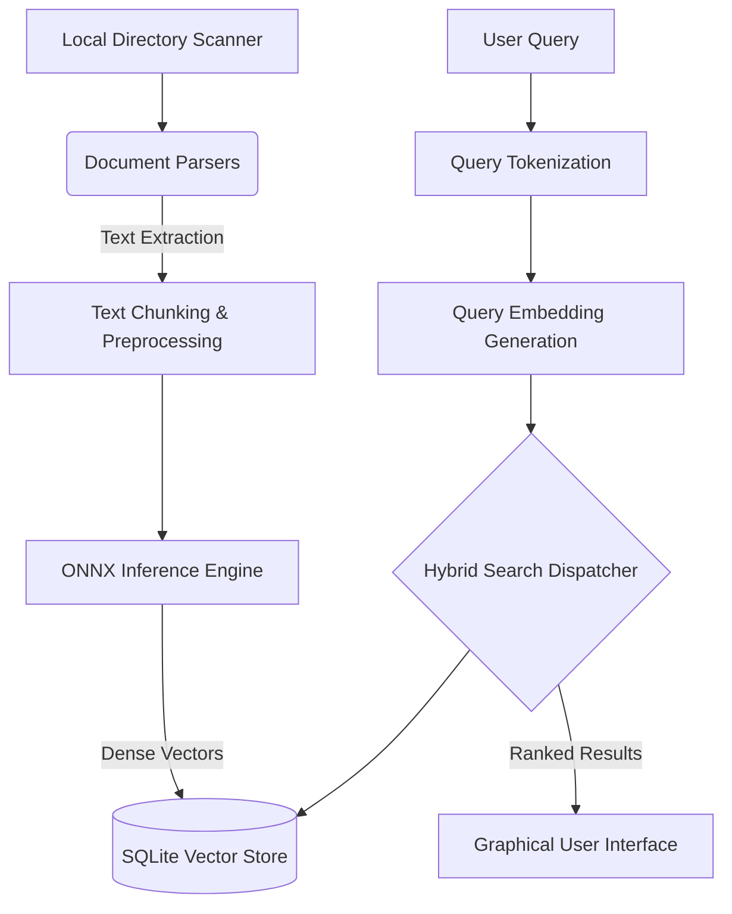

<div align="center">
  

  # NeuraFind: Offline Semantic Document Intelligence

  **A Local-First Information Retrieval and Vector Search Engine for Windows Environments**

  <br>

  <!-- Status & License Badges -->
  [](https://opensource.org/licenses/MIT)
  []()
  []()
  
  <!-- Technology Stack Badges -->
  [](https://www.python.org/)
  [](https://www.microsoft.com/windows)
  []()
  
  <!-- Core Frameworks Badges -->
  [](https://wiki.qt.io/Qt_for_Python)
  [](https://onnxruntime.ai/)
  [](https://www.sqlite.org/)

</div>

<br>

---

## Abstract

**NeuraFind** addresses the growing privacy concerns associated with cloud-based document search engines by providing a strictly local, offline-first semantic search architecture. By leveraging quantized transformer models via the ONNX Runtime, NeuraFind computes high-dimensional vector embeddings of local documents (PDF, DOCX, XLSX, PPTX) entirely on consumer-grade hardware. This enables users to perform complex conceptual queries and retrieve contextually relevant information without exposing sensitive data to external networks.

## Core Architectural Features

*   **Semantic Vector Space Modeling:** Utilizes state-of-the-art multilingual sentence transformers (e.g., `paraphrase-multilingual-MiniLM-L12-v2`) to map textual data into a dense vector space, enabling meaning-based retrieval rather than relying solely on lexical overlap.
*   **Hybrid Retrieval Engine:** Implements a multi-tiered search methodology:
    *   *Exact Matching:* Traditional boolean retrieval for precise term isolation.
    *   *Fuzzy Matching:* Levenshtein distance-based algorithms to account for typographical variances.
    *   *Semantic Search:* Cosine similarity computations against the local SQLite vector store to retrieve conceptually related documents.
*   **Absolute Data Sovereignty:** The system architecture is designed to operate in air-gapped environments. Document parsing, tokenization, embedding generation, and indexing are confined entirely to the host machine.
*   **Asynchronous Interface Design:** Developed utilizing `PySide6` (Qt), the graphical interface maintains high responsiveness during computationally intensive background tasks (indexing and tensor operations) via robust multithreading.

## Data Flow & Architecture

The application is structured into decoupled modules to ensure maintainability and high performance:



## System Requirements and Installation

### Prerequisites
*   Python 3.11 or higher
*   Windows 10 / 11

### Developer Setup
1.  **Clone the repository:**
    ```cmd
    git clone https://github.com/Hussein-Furaty/NeuraFind.git
    cd NeuraFind
    ```
2.  **Environment Configuration:**
    ```cmd
    python -m venv .venv
    .venv\Scripts\activate
    pip install -r requirements.txt
    ```
3.  **Application Execution:**
    ```cmd
    set PYTHONPATH=.
    python src\neurafind\app.py
    ```

### Production Build (Executable)
To generate a standalone Windows installer utilizing PyInstaller and Inno Setup:
```cmd
scripts\build_all.bat
```
*Note: Requires Inno Setup 6 to be installed on the host machine.*

## Technical Acknowledgements & Dependencies

NeuraFind is built upon robust open-source foundations. The development of this application heavily relied on the following libraries and frameworks:

*   **[ONNX Runtime](https://onnxruntime.ai/):** Provides the cross-platform, high-performance machine learning inference engine used for local embedding generation.
*   **[PySide6 (Qt for Python)](https://wiki.qt.io/Qt_for_Python):** The core framework driving the application's graphical user interface and multithreading architecture.
*   **[Hugging Face Transformers](https://huggingface.co/):** Utilized for text tokenization algorithms (`XLMRobertaTokenizerFast`).
*   **[Xenova Models](https://huggingface.co/Xenova):** Acknowledgment for the optimized, quantized ONNX port of the `paraphrase-multilingual-MiniLM-L12-v2` model, which makes local inference feasible on standard CPUs.
*   **[PyMuPDF](https://pymupdf.readthedocs.io/):** Enables highly efficient text extraction algorithms for PDF parsing.
*   **[RapidFuzz](https://maxbachmann.github.io/RapidFuzz/):** Implements the optimized string matching metrics used in the fuzzy search module.

## Author

**Hussein Al-Furati**  
*Cybersecurity Student, Software Developer, and AI Researcher.*  
Email: hussein.a.habeeb.sec@gmail.com  
GitHub: [@Hussein-Furaty](https://github.com/Hussein-Furaty)

## License

This project is released under the **MIT License**. See the [LICENSE](LICENSE) file for complete details. The accompanying End User License Agreement (EULA) within the installer details specific terms concerning local data privacy and liability.
